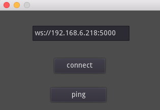

# nodejs-godot-websockets
Example of combining a nodejs server with a Godot client via websockets.
This is just a proof of concept that you can use websockets in the combination Node plus Godot from an Android APK.


## Server

The server is a very simple Node websocket server that only receives messages, and sends one 'ping' every second. Initialize it with ```yarn``` or ```yarn add ws``` and start it with ```node server.js```.


## Client

Here's how it looks.



Enter the correct ip and start the connection.

## Client APK

To export the APK, set the 'package/unique name' (or leave it as com.ce.client) and add the keys; there are default debug keys here:

- Windows Vista, 7, 8: C:\Users\.android\
- Linux/OS X : ~/.android/

with user/pass: androiddebugkey/android

It's important that you set android.permission.INTERNET to true which is here:


To monitor the app, you need Android Studio installed:

```
cd ~/Library/Android/sdk
./platform-tools/adb shell "logcat | grep 'godot'"
```

To install it via adb:
```
cd ~/Library/Android/sdk
./platform-tools/adb install -r your-apk-location
# just for completeness, uninstall via adb:
# ./platform-tools/adb uninstall com.ce.client

```


## Other info

I didn't use this lib, but it promises to mitigate websocket problems:
- https://github.com/gd-com/utils
